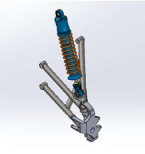
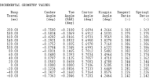

# Optimization of a Double Wishbone Suspension Geometry for Off-road Vehicles using Genetic Algorithm and Machine Learning

## Introduction

This project explores methods to predict wheel alignment angles and optimize double wishbone suspension geometry for off-road vehicles. Suspension three dimensional points are evaluated using a Genetic Algorithm for desirable values of toe, camber, kingpin and castor angles. A regression methodology is employed to accurately predict these angles at all values of the bump angle. For prime vehicle performance of an ATV in bumps and droops, all four angles must lie between their specific ranges. Genetic Algorithm incorporates these constraints to determine chromosome fitness, and generate better off springs. Selection, crossover, and mutation are operated on each generation of the populations to converge towards most ideal coordinates. This repository contains implementation for our work <a href="https://ieeexplore.ieee.org/document/9852873">**Optimization of a Double Wishbone Suspension Geometry for Off-road Vehicles using Genetic Algorithm and Machine Learning**</a> published in <a href = "http://www.icmae.org">ICMAE 2022</a>.

## Project Layout 

To ease the implementation and integration of genetic algorithm and machine learning, the project is structured in the following manner - 

```
    .
    ├── Dataset                 # Excel Sheets containing suspension data
    |
    ├── Models                  # Gaussian Regression Models stored as a mat file
    |
    ├── Python                  # Python implementation of GA and ML is also provided
    │   ├── Population          # Dataset containing different excel sheets
    │   ├── ML_Model.h5         # Keras Model
    │   └── Genetic.py          # Genetic Algorithm that returns the optimized geometry
    |
    ├── Dataset_Create.m                 # Loads the dataset initially from excels sheets
    ├── Prepare_Dataset.m                # Prepares the dataset for optimization at every iteration
    ├── Roulette_Wheel_Selection.m       # Selection Algorithm
    ├── crossover.m                      # Crossover Algorithm
    ├── mutation.m                       # Mutation Algorithm
    ├── fitness_function.m               # Fitness Function used for optimization
    └── Genetic_Algorithm.m              # Optimises the suspension geometry
    
```
## Double Wishbone Model

A vehicle’s suspension is a system that helps maintain a smoother ride by negating surface irregularities. This system connects the vehicle with its wheels. When designing a suspension system, the main objectives are to:
* Maintain maximum surface contact
* Improve vehicle handling
* Maximize driver comfort

Double wishbone is an independent system in which two wishbone shaped control arms are connected between the knuckle and the vehicles chassis. It is the preferred front suspension geometry for off road vehicles as they are easily adjustable, simple to manufacture and cost effective. We are focusing on the double A-Arm design in this research and have proposed a geometry design optimization algorithm. The geometry of the suspension is damper to lower wishbone as shown in figure. Suspension geometries are analyzed in the lotus suspension software.

<p align="center">

</p>

## Optimization Results

The complete project was implemented in <a href="https://in.mathworks.com/products/matlab.html">MATLAB</a>, though codes in <a href="https://www.python.org">Python</a> are also available in the <a href="https://github.com/Shaswat2001/GA-for-Suspension-Optimization/tree/master/Python">repository</a>. For the given project we used **roulette selection**, **Weighted average arithmetic crossover** and **creep mutation** was used for the optimization purpose. The geometry given by the algorithm, was vaidated using LOTUS suspension software, the result of which are shown in the figure. 

<p align="center">

</p>

The desired results were near zero values for both camber and toe on bump travel between 200mm and -60mm. The castor and kingpin angles lie in the desired ranges

## Citation

I would appreciate if you cite my work, in case you are using it for your work. Thank you :-)

```python

@inproceedings{garg2022optimization,
  title={Optimization of a Double Wishbone Suspension Geometry for Off-road Vehicles using Genetic Algorithm and Machine Learning},
  author={Garg, Shaswat and Dudeja, Satwik and Gupta, Satwik and Rastogi, Vikas},
  booktitle={2022 13th International Conference on Mechanical and Aerospace Engineering (ICMAE)},
  pages={472--477},
  year={2022},
  organization={IEEE}
}

```

## Contact

If you have any questions, please let me know:

- Shaswat Garg {[sis_shaswat@outlook.com]()}
